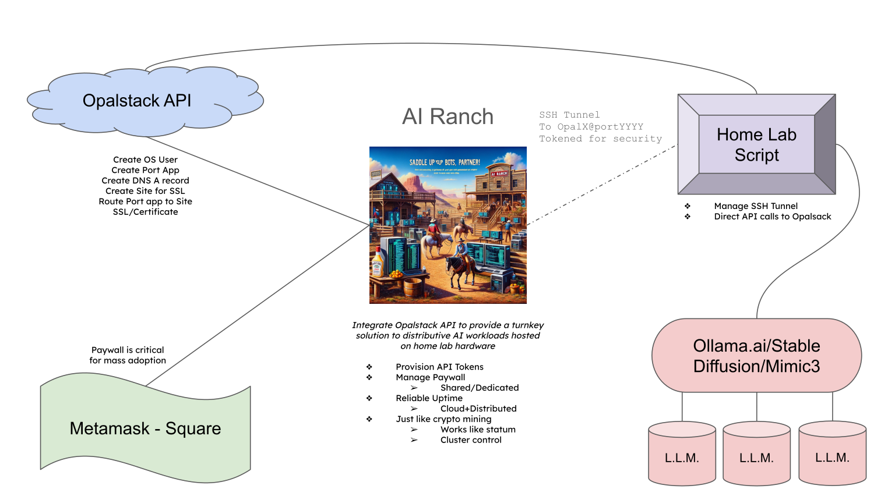

# AI Ranch

Welcome to AI Ranch, the groundbreaking project that aims to revolutionize the AI landscape by decentralizing and distributing AI workloads in a manner akin to what mining did for cryptocurrency. This initiative is dedicated to harnessing the collective power of distributed computing resources to democratize access to artificial intelligence, making powerful AI more accessible to developers, researchers, and enthusiasts around the globe.

## Project Scope

At AI Ranch, our vision extends beyond the conventional boundaries of AI research and development. We are committed to creating an ecosystem where AI workloads are distributed across a network of participants, leveraging idle computing power from devices all around the world. This approach not only democratizes the development and utilization of AI but also optimizes computational efficiency, reducing waste and making AI research more sustainable.

## Key Features:

- **Secure SSH Tunneling for AI Workloads**: AI Ranch employs SSH tunneling to securely connect the distributed computing resources from personal home labs to our centralized platform. This method guarantees secure, efficient, and dependable access to computing power for AI tasks, emphasizing privacy and direct hardware access.
- **Integration with Traditional Web Hosting**: Tailored for ease of use, AI Ranch integrates seamlessly with traditional web hosting solutions, such as Opalstack, to facilitate the connection of computing resources to our network, simplifying the process for users to contribute their computing power.
- **Full-Scale Support for AI Development**: From setting up your environment to debugging complex AI models, our in-house support team is dedicated to assisting AI Ranch participants every step of the way. We aim to be your go-to support and developer companion, helping to bring your AI startup ideas to life.
- **Open Source Platform with Entrepreneurial Support**: AI Ranch is built on an open-source foundation, encouraging innovation and collaboration. We offer additional paywalled features and services designed to support the launch and growth of creative AI startups, providing a nurturing environment for entrepreneurs in the AI space.
- **Monetization and Privacy-First Approach**: Our platform enables participants to monetize their old or idle hardware by contributing it to AI development tasks, with a strong emphasis on privacy and avoiding censorship. This is particularly valuable during the early stages of startup development, where access to specialized hardware and data privacy are critical.

### How It Works:

1. **Easy Setup for Developers**: Sign up on the [Opalstack](https://opalstack.com/) platform and follow our straightforward setup guide to prepare your home lab hardware for participation. This setup includes configuring SSH tunnels for secure and effective access to computing resources.
2. **Seamless Web Hosting Integration**: AI Ranch's design ensures easy integration with traditional web hosting, harmonizing stability and centralized control with distributed workloads. 
4. **Comprehensive Support**: Our in-house support team is on standby to offer assistance with technical setup, troubleshooting, and optimization, ensuring you can focus on developing innovative AI solutions without getting bogged down by technical issues.
5. **Monetize and Innovate**: Its your hadware, its your centralized control software, its your money. We only "sell the shovels" in the sense of providing support for the proejct and the web2 back-end. The rest is yours. We seek to build an industry together.
6. **Foster Collaboration**: Join a community of developers, researchers, and AI enthusiasts. AI Ranch encourages collaboration, innovation, and the sharing of resources and knowledge within the ecosystem, all while supporting your startup's growth in a privacy-conscious environment.

AI Ranch represents a novel approach to AI development, combining the benefits of distributed computing with the security of SSH tunneling and the support of traditional web hosting environments and pay models. Our platform is not just about contributing computing power; it's about fostering innovation, supporting privacy, and helping entrepreneurs overcome the barriers to entry in the AI industry.

## Join Us

AI Ranch is more than just a project; it's a movement towards a more open, accessible, and sustainable future for AI. Whether you're an AI expert, a developer, or simply someone passionate about the potential of artificial intelligence, there's a place for you here.

Become a part of AI Ranch today and help shape the future of distributed artificial intelligence. Together, we can build something truly revolutionary.

---

For more information, watch our [GitHub repository]([#](https://github.com/d3cline/airanch/)) or join our [community forum](https://community.opalstack.com/) to connect with fellow AI enthusiasts and contributors.

